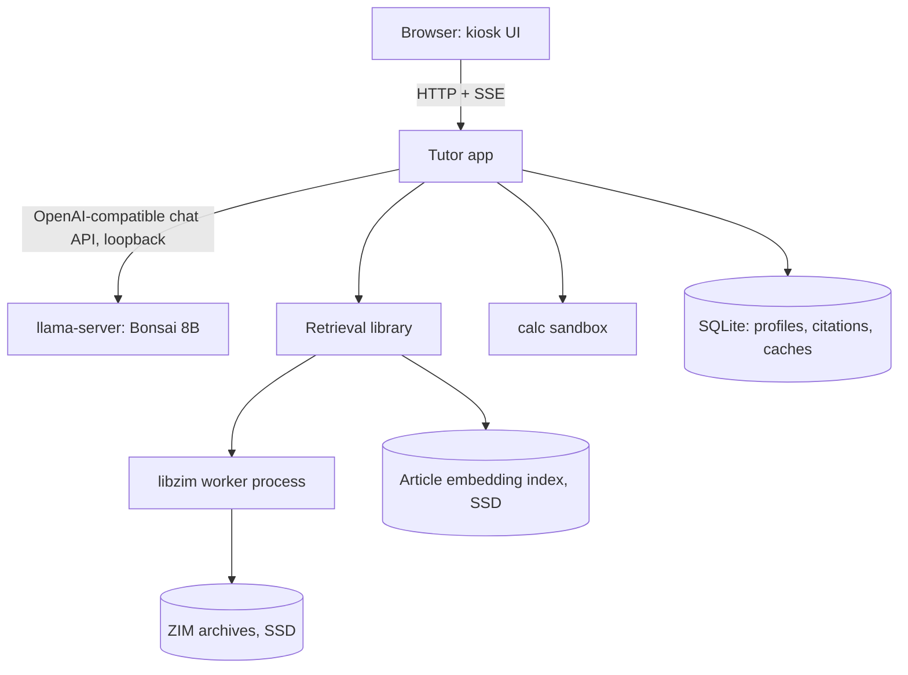

# Offline School Tutor — Implementation Specification

**Version:** 0.3
**Date:** 2026-09-19
**Target:** Dell Inspiron 7577 — i5-7300HQ (4C/4T), 16 GB DDR4, 256 GB SATA SSD, GTX 1060 Max-Q 6 GB, Linux Mint
**Status:** Proposed redesign. Model choice, process model, storage plan, routing, and context budget replaced; retrieval pipeline, citation model, offline acceptance, and evaluation carried forward from v0.2 with amendments.
**Supersedes:** v0.2.

---

## 0. What changed from v0.2 and why

| Area | v0.2 | v0.3 | Reason |
|---|---|---|---|
| Model | Bonsai 2 27B PTQ1_0 (5.95 GB) | **Ternary Bonsai 8B Q2_0 (2.03 GiB)**, Qwen3-8B base | 27B does not fit resident on 6 GB; its quality numbers are thinking-mode only. 8B is fully resident with 16K context and keeps instruction-following/tool-calling near full precision. |
| Context | 4K start, 8K target | **16K target, 8K floor**, q8_0 KV | Weights no longer consume the card. 450 tokens of history was three exchanges. |
| Routing | Model decides whether to call `research` | **Host pre-retrieves on every new question**; model may request one refined follow-up | Retrieval is cheaper than generating the tool call, and the tool-call route forces a second prefill. |
| Retrieval process | Host → MCP server (stdio) → worker | **In-process library** + one libzim worker subprocess; MCP wrapper is dev-only | Three processes for one function call; MCP adds nothing inside a single-user app. |
| Storage | ZIMs on external HDD | **Everything on the SSD** | Xapian index seeks on an HDD blow the latency budget; the SSD has ~225 GB free. |
| First archive | Full English Wikipedia | **Simple English Wikipedia** primary, full Wikipedia second tier | Written at student reading level; small enough to embed at install time. |
| Embeddings | Prohibited corpus-wide | **Install-time article-level embeddings** for Simple Wikipedia; runtime downloads still prohibited | Fixes synonymy the deterministic planner cannot. Cheaper than the v0.2 cross-encoder plan. |
| Tools | `research` only | `research` + **`calc`** | A tutor that does arithmetic in its head grades wrong answers right. |
| Prompt layout | Evict/trim freely | **Append-only regions**; eviction = accepted full re-prefill | Dense-model prompt cache is prefix-only; edits mid-prompt re-prefill everything after. |
| Phase 0 | "Measure first, keep Bonsai preferred" | **Numeric go/no-go + three-model bake-off** | A stated threshold, not a preference. |

Everything else in v0.2 that is not mentioned in this table is retained.

---

## 1. Goal and fixed constraints

Build a school tutor that works with no internet connection after installation. A local ternary 8B model handles teaching, explanation, and conversation. Local Kiwix ZIM archives supply factual evidence through a bounded retrieval library. A sandboxed calculator verifies arithmetic.

Every new factual question gets one automatic retrieval before the model sees it. The model may request one refined follow-up retrieval if the evidence is insufficient. Hard cap: two retrievals per student turn. No remote model, web fallback, runtime download, telemetry, or license check exists anywhere in the execution path.

First release: one student at a time, English, local text interface in a browser. Student profiles selectable between sessions. Speech, image input, multiple simultaneous students, and background agents are later work.

---

## 2. Hardware facts that drive the design

| Fact | Consequence |
|---|---|
| GTX 1060 Max-Q: 6 GiB, ~192 GB/s, compute capability 6.1, no tensor cores, ~60–80 W sustained | Decode is bandwidth-bound: ceiling ≈ 192 / 2.18 ≈ 88 tok/s for a 2.18 GB model; realistic 30–45 tok/s. Prefill is compute-bound and the weaker side. CUDA 12.x toolchain; source build with `sm_61`. |
| Optimus laptop | With NVIDIA Prime in **on-demand/hybrid** mode, the Intel iGPU drives the display and the 1060 starts empty. In "performance" mode the desktop costs 200–400 MiB of VRAM. Set on-demand and verify with `nvidia-smi`. |
| i5-7300HQ: 4 cores, 4 threads, no hyperthreading | With the model fully on GPU, inference needs 1–2 host threads. Give the rest to retrieval and the browser. Never run 4 inference threads. |
| Dell 7577 thermal envelope | Known throttler. Benchmarks are 10-minute sustained runs, not 128-token bursts. Log clocks and temperatures. |
| 16 GB RAM | Model mmap + page cache ≈ 2 GB, browser ≈ 1 GB, retrieval worker ≤ 1 GB, OS ≈ 2 GB. Comfortable. Keep ≥ 2 GiB `MemAvailable` under load. |
| 256 GB SATA SSD | OS ~15 GB, runtime ~5 GB, model ~2.5 GB. ~225 GB free for archives, embeddings, caches. |

---

## 3. Model

### 3.1 Primary: Ternary Bonsai 8B (Q2_0)

Publisher: prism-ml. Base: Qwen3-8B. 36 dense transformer blocks, GQA 32/8, 65K native context, vocab 151,936. Packed Q2_0 g128 (2.125 bpw), **2.03 GiB** on disk; embeddings and LM head are ternary too. Apache 2.0. Requires the PrismML-Eng/llama.cpp fork (`prism` branch); Q2_0 is not in mainline.

Publisher benchmarks vs. full-precision Qwen3-8B: MMLU-Redux 72.6 vs 83, IFEval 81.8 vs 81.5, BFCL 73.9 vs 81, GSM8K 91 vs 93. Interpretation for this project: the model lost parametric knowledge and kept behavior. Retrieval supplies knowledge; behavior is what the tutor needs.

**Memory envelope (planning, to be replaced by loader-reported numbers):**

| Item | Estimate |
|---|---|
| Weights on GPU (token_embd stays in host RAM by default) | ~1.9 GiB |
| KV cache, q8_0, 16K | ~1.15 GiB (~72 KB/token) |
| Compute buffers + CUDA context | ~0.4–0.6 GiB |
| **Total** | **~3.5–3.7 GiB** |

Headroom of >2 GiB on a 6 GiB card. This is the point of the model choice: no offload, no fit negotiation.

**Performance (planning numbers, superseded by Phase 0 measurements):**

| Metric | Estimate | Basis |
|---|---|---|
| Decode, short context | 30–45 tok/s | 35–55% of 192 GB/s; bracketed by Prism's Metal efficiency (~61%) and Tyler's 1070 PTQ1_0 result (~35%) |
| Decode, 8K filled | 25–35 tok/s | +590 MB KV read per token |
| Prefill | 100–400 tok/s | Depends on whether the fork's CUDA Q2_0 path uses dp4a int8 or fp32 dequant + cuBLAS |
| 3K-token uncached prompt | 8–30 s | Why prompt layout (§8) matters |

### 3.2 Reasoning and sampling

Qwen3's chat template exposes a thinking toggle. **Default: thinking off** for ordinary tutoring. Sampling for non-thinking mode: `temp 0.7, top_p 0.8, top_k 20, min_p 0, presence_penalty 1.5`. If Phase 0 shows a measurable teaching-quality gain, test a bounded thinking budget of 300–500 tokens (`temp 0.6, top_p 0.95, top_k 20`) and reserve those tokens in the budget table. Never deploy unbounded thinking.

### 3.3 Fallback and stretch candidates

| Role | Model | Notes |
|---|---|---|
| Fallback (stock llama.cpp) | Qwen 3.5 4B, Q6_K (~3.5 GB) | Hybrid attention, small KV, native tool calling, no fork dependency. Chosen if the fork's CUDA Q2_0 path fails on Pascal or the 8B fails the quality gate. |
| Alternate fallback | Gemma 4 E4B QAT (~4.3 GB) | If Qwen's non-thinking explanations feel flat. Sliding-window attention has its own prompt-cache behavior in llama.cpp. |
| Stretch | Bonsai 2 27B PTQ1_0 | Only if a later Phase 0 rerun shows it resident with ≥7 tok/s sustained. Not on the critical path. |

The interface between host and model is the OpenAI-compatible chat/tools API of llama-server, so swapping candidates is a config change.

---

## 4. Components and process model

Two processes plus a browser.

| Component | Responsibility | Implementation |
|---|---|---|
| **Inference server** | Tokenize, prefill, decode, parse tool calls, report timings | Pinned build of the Prism llama.cpp fork (`llama-server`), loopback only, `--jinja`, `-fa on`, `-ctk q8_0 -ctv q8_0`, `-c 16384`, `-ngl 99`, `-t 2` |
| **Tutor app** | Serve UI, stream answers (SSE), own the agent loop, prompt budgets, tool dispatch, citation resolution, session/profile state | One Python process (FastAPI or equivalent), loopback only |
| ↳ Retrieval library | Query planning, hybrid search, extraction, passage ranking, packet rendering | Module inside the tutor app |
| ↳ libzim worker | Archive handles, Xapian search, entry reads | One long-lived child process of the tutor app; killable; not thread-shared |
| ↳ Calculator | Sandboxed expression evaluation | Module inside the tutor app; subprocess with timeout |
| **UI** | Chat, stop, student selector, simpler/deeper/hint, source viewer, status | Static HTML/CSS/JS served by the tutor app; browser in kiosk mode |
| **Local data** | Profiles, lesson state, citation snapshots, caches, embedding index | SQLite + flat files on SSD; ZIMs read-only |



**Development-only MCP adapter.** The retrieval library and calculator are exposed as an MCP server behind a `--dev-mcp` flag so Claude Code or other tools can exercise them during development. It is not in the production process tree and is not required for any student-facing behavior.

---

## 5. Turn lifecycle

1. **Receive.** The UI sends either a free-text message or a deterministic action (`simpler`, `deeper`, `hint`, `research_this`).
2. **Route by action type, not by parsing text.**
   - Deterministic actions → skip retrieval, append an action-specific instruction, go to step 5.
   - Free-text message → step 3.
3. **Pre-retrieve.** The host calls `research(query=message, topic_hint=current_subject)` before the model sees anything. Target ≤ 1 s warm. The packet is merged into the retained lesson evidence (dedupe by passage ID).
4. **Build the prompt** in the append-only layout of §8 and token-count it with the runtime's tokenizer endpoint.
5. **Inference request 1.** The model answers, asks a clarification, or emits a tool call. Tool calls arrive parsed by llama-server; the host validates them against a JSON schema. Prose is never parsed as a tool call.
6. **Tool dispatch.**
   - `research(query, keywords[])` → run retrieval (this is call 2 of 2), append result as a tool message, resume.
   - `calc(expression)` → run sandbox, append result, resume. Calculator calls do not count toward the retrieval cap; cap them at 4 per turn.
7. **Inference request 2** (if a tool was called). The prompt is request 1's prompt plus the tool exchange — a pure append, so the prefix is a cache hit.
8. **Finish.** Stream the answer, resolve citation labels to saved snapshots, store the turn, keep the evidence set.

If the model requests a second `research` after the cap, the host returns a tool result stating the cap is reached and the model answers the supported portion or asks for clarification.

**Cost of each route (planning):**

| Route | Model calls | Prefill | Retrieval |
|---|---|---|---|
| `simpler` / `hint` | 1 | cache hit + ~50 tokens | 0 |
| New question, evidence sufficient | 1 | cache hit + question + new evidence | 1 |
| New question, model asks for more | 2 | as above, then append-only | 2 |

---

## 6. Archives and storage

All on the SSD. The external HDD is optional cold storage for image-bearing `_maxi` editions used only by the source viewer.

| Tier | Archive | Size | Role |
|---|---|---|---|
| 1 | `wikipedia_en_simple_all_maxi` | ~2 GB | Primary. Reading-level appropriate; embedded at install time. |
| 2 | `wikipedia_en_all_nopic` | ~60 GB | Fallback when tier 1 coverage is weak. Full-text index only, no embeddings in v1. |
| 3 | `wikibooks_en_all`, Wikipedia for Schools | ~10 GB | Subject-specific supplements, registered by subject tag. |

Default search order: tier 1 → tier 2 only if coverage flags are weak after tier 1. Teacher-selected subject hints may promote tier 3 archives.

Registration, integrity validation at import, `has_fulltext_index` checks, `title_only` handling, redirect resolution, edition fingerprints, and update/invalidation rules are unchanged from v0.2 §6.

### 6.1 Install-time embedding index (tier 1 only)

At install, run a small English embedding model (30–110M parameters, ONNX or GGUF, weights bundled in the installer) over every tier-1 article: title + first ~400 words. Store fp16 vectors in a flat file with an article-path sidecar. For Simple Wikipedia this is ~250K × 384 × 2 bytes ≈ 200 MB and runs on the GPU in well under an hour. The embedding model stays loaded at runtime (≈100 MB RAM, CPU inference for one query vector is ~10 ms).

Rules: brute-force dot product over the flat file (no ANN library needed at this size); index keyed by archive edition fingerprint and embedding-model version; rebuilt on archive replacement; never queried for tier 2/3 unless an index exists for that edition. No embedding of tier 2 in v1 — measure whether tier 1 + lexical tier 2 is enough first.

---

## 7. Retrieval library

### 7.1 Contract

Internal function, also exposed via the dev MCP adapter:

```json
{
  "query": "Why did the Roman Empire split into eastern and western halves?",
  "keywords": ["Diocletian", "tetrarchy"],
  "topic_hint": "Roman history",
  "evidence_budget_tokens": 1800,
  "archive_ids": ["simple-wikipedia"],
  "language": "en",
  "prior_request_id": null
}
```

`keywords` is new: up to 3 short strings, model-supplied on follow-up calls only, each ≤ 40 characters, sanitized. The host-initiated pre-retrieval passes `keywords: []`. Everything else follows v0.2 §7 validation rules. The model still cannot specify paths, budgets, archives, or query-parser operators.

### 7.2 Pipeline

Deterministic given the same inputs, editions, and config. Stage caps from v0.2 §8 are retained; the five knobs exposed in config are: hits per query, articles extracted, passages in packet, evidence budget, and soft deadline. Everything else is hard-coded until the evaluation set says otherwise.

1. **Normalize and plan.** Build two lexical variants (phrase-conservative, keyword-broad) plus the model keywords if present. Embed the full original question for dense retrieval. No glossary expansion in v1 — dense retrieval replaces it.
2. **Search.** Three candidate lists: Xapian full-text per variant (via libzim, top 16 each), and dense top 16 over the tier-1 index. Resolve redirects (≤ 8 hops), dedupe by edition + canonical path.
3. **Fuse.** Reciprocal rank fusion, `1/(60 + rank)`, all weights 1, logged. Tie-break: title-phrase match, then archive order, then path.
4. **Extract.** Top 6 articles (cap 10). Pinned HTML parser, external loading disabled, per-family fixtures. Preserve headings, paragraphs, lists, table rows with headers, units, math text. Size caps and `non_text_content_needed` as in v0.2 §8.3.
5. **Passages.** Heading-aware groups of 80–180 words, one article at a time, per-article quotas, ≤ 300 scored.
6. **Rank.** BM25 over the request's passage pool (`k1 1.2, b 0.75`, positive IDF, pinned tokenizer), fused with heading rank; entity/phrase coverage breaks ties. Exact dedupe, then shingle Jaccard ≥ 0.85 with the "adds no new entity/number/polarity" rule. ≤ 2 passages per article unless coverage requires more.
7. **Pack.** Greedy by relevance × new facet coverage / token cost, trimmed at sentence boundaries, exact extracts only.

### 7.3 Response

Unchanged from v0.2 §9: versioned structure with `status`, `reason_codes`, `coverage`, `followup_recommended`, `alternatives`, `sources`, `passages`, `budget`, `metrics`. No numeric confidence. Coverage signals are explainable (facets represented, entities missing, limits hit).

### 7.4 Deadlines and worker isolation

Soft deadline 3 s, hard 8 s (tightened from 5/12 because the SSD removes the HDD case). Xapian search and entry reads run in the worker process so a stuck read cannot block the app's event loop; the app kills the worker at the hard deadline, returns completed stages as `partial`, and restarts one worker. Never more than one worker alive.

---

## 8. Prompt layout and context budget

### 8.1 Append-only regions

The Bonsai 8B is a dense model; llama-server reuses a KV prefix only while the prompt is byte-identical up to the divergence point. Any edit above a position re-prefills everything after it. The prompt is therefore a strict chronological log that is **append-only within a lesson**:

```
system (prompt, tool schemas, profile, subject)   ← fixed for the session
[user q1] → [tool: evidence packet 1] → [assistant a1]
[user q2] → [tool: evidence packet 2] → [tool: calc] → [assistant a2]
...
```

Each evidence packet is rendered once, as a tool result at the point in history where it arrived, with numbered `[S#]` labels that stay stable for the lesson. "Retained evidence" means the log is not truncated; there is no separately re-rendered evidence block. The model sees each packet in the turn it was fetched, and every new turn is a pure append to the previous prompt, so the prefix is a cache hit.

**Eviction.** When the prompt would overflow, drop the oldest `[user, tool, assistant]` triples from the head of the history until it fits, keeping the system region and any triple whose evidence is cited by the last two answers. This is a head edit and forces a full re-prefill of the remainder — accepted and logged as an `eviction_reprefill` event. On a subject change the host may start a new lesson (fresh history) instead. Never splice from the middle.

### 8.2 Budget

Token counts via the runtime's tokenizer/apply-template endpoints, verified against parity fixtures. Enforce:

`rendered_prompt_tokens + reserved_generation_tokens + safety_margin ≤ configured_context`

| Allocation | 8K floor | 16K target |
|---|---:|---:|
| System, tool schemas, profile | 700 | 800 |
| History incl. evidence tool results | 4,000 | 10,000 |
| Newest question + newest packet | 1,300 | 2,000 |
| Reserved generation (visible answer, or +400 if bounded thinking is enabled) | 1,200 | 1,600 |
| Safety margin | 992 | 1,984 |
| **Total** | **8,192** | **16,384** |

Evidence packet budget defaults to 1,200 tokens at 8K and 1,800 at 16K. Default answer style: short explanation plus one check-for-understanding question; `deeper` extends.

---

## 9. Tools

### 9.1 `research`

Described in §7. Exposed to the model with two fields only: `query` (required) and `keywords` (optional, ≤ 3). Tool description tells the model it is a *second* lookup and should be used only when the evidence already provided does not cover a specific claim it needs to make.

### 9.2 `calc`

`calc(expression: string)` → `{ "ok": true, "result": "…" }` or `{ "ok": false, "error": "…" }`.

Implementation: `sympy` parsing with a whitelist of functions (arithmetic, powers, roots, trig, log, fractions, basic solving of one linear/quadratic equation), no attribute access, no imports, no names beyond the whitelist, ≤ 200 characters, executed in a subprocess with a 1-second wall-clock limit and a 64 MB memory cap. Results are exact where sympy gives exact forms; the host also appends a decimal approximation.

The system prompt instructs the model to call `calc` before asserting any numeric result beyond single-digit arithmetic, and to show the student the expression it evaluated. Calculator results are rendered distinctly from source-backed facts in the UI.

### 9.3 Tool-call integrity

llama-server (`--jinja`) parses Qwen3's native tool-call format into structured calls. The host additionally validates every call against the tool's JSON schema and rejects unknown tools, extra fields, or malformed arguments with a tool-result error the model can recover from. If Phase 0 shows more than ~2% malformed calls on the scripted routing lessons, enable `response_format`/grammar constraints for the tool-call turn.

---

## 10. Memory, scheduling, cancellation

| Resource | Policy |
|---|---|
| GPU | Fully resident model. If loader reports any offloaded layers, Phase 0 fails; fix the build or drop to fallback. |
| Inference host threads | 2 |
| Retrieval threads | 1 for Xapian/libzim (worker), 1 for BM25/embedding (app) |
| Retrieval worker | ≤ 512 MiB target, 1 GiB hard cgroup limit |
| Embedding model | ≤ 150 MiB resident |
| App RAM cache | 128 MiB |
| SSD retrieval cache | 1 GiB, LRU |
| OS headroom | ≥ 2 GiB `MemAvailable` |
| In-flight | One student turn; a new submit cancels the previous generation via the server's cancel and discards its tool calls by turn ID |

libzim searcher objects are not thread-safe; they live only in the worker. The model is never unloaded to search.

---

## 11. Citations, learner state, caching

Carried forward from v0.2 §12 without change: immutable passage IDs derived from edition + path + extractor version + content; `[S#]` labels resolved by the host and rejected if unresolved; "show source" renders the saved extract with title, heading, edition date, attribution; optional full-article view through a local viewer with all remote references stripped; citation snapshots stored separately from disposable caches and archived/deleted with their sessions as a unit; learner state kept small and explicit; cache identities include planner/extractor/ranker versions and edition fingerprints; an uncached run must work after all disposable caches are deleted.

Added: the embedding index is a cache with a required rebuild, not a disposable one — deleting it degrades tier-1 retrieval to lexical-only and the UI status must say so.

Added: the source viewer highlights the exact sentence(s) the answer cited, using the passage's stored character offsets.

---

## 12. UI

Static HTML/CSS/JS, no framework required, no external assets. Kiosk-mode browser at startup.

| Element | Behavior |
|---|---|
| Chat pane | Streams tokens via SSE; renders `[S#]` labels as tappable chips; renders `calc` results in a distinct style |
| Stop | Cancels the current generation |
| Student selector | Between sessions only; loads profile and last lesson summary |
| Simpler / Deeper / Hint | Deterministic host actions, no retrieval, no routing decision |
| Research this | Explicit pre-lookup with the current message as the query; same path as the default, exists so a student can force a fresh search |
| Source viewer | Saved extract, cited sentence highlighted, attribution, edition; optional full article via local viewer |
| Status | Model loaded, archives healthy, embedding index present, warm/cold cache state; derived from local checks only |

Open WebUI (which Prism's demo repo supports) may be used for an afternoon of exploratory testing of the 8B's tool behavior, but is not part of the product.

---

## 13. Offline installation and operation

Unchanged from v0.2 §13, with these additions:

- The installer bundles: the fork build (with `sm_61`), the 8B GGUF, the fallback GGUF, the embedding model weights, Python wheels including `libzim`, `sympy`, and the ONNX/GGML runtime for embeddings, UI assets, stopword list, manifest with SHA-256 for every file.
- Install performs the tier-1 embedding pass and records the index fingerprint in the manifest.
- Startup verifies NVIDIA Prime mode and warns if the 1060 is driving the display.
- The offline acceptance test additionally asserts that the embedding pass and the calculator make no network calls.

---

## 14. Teaching behavior

Unchanged from v0.2 §14, with these additions:

- The system prompt distinguishes three kinds of statement the tutor can make: **source-backed** (cite `[S#]`), **computed** (show the `calc` expression), and **tutor's own example/derivation** (say so). The UI styles them differently.
- For a student's own work in math, the tutor calls `calc` to check the student's answer *before* commenting on it.
- The tutor never says the library has no answer after a `partial`, `unavailable`, or timeout status; it says the search was incomplete.

---

## 15. Logging and evaluation

Logging fields from v0.2 §15 are retained. Added: `route` (`action` / `preretrieve` / `preretrieve+followup`), `calc_calls`, `eviction_reprefill` events, prompt-cache hit tokens per request, and GPU clock/temperature samples.

Evaluation set: the 60-question structure from v0.2 (20 direct, 10 why/how, 10 comparison, 5 elliptical follow-up, 10 ambiguity/false-premise/absent, 5 tables/formulas/unicode/image-dependent), labeled against installed editions, 30/30 tune/held-out. Added: **10 arithmetic/algebra items** where the student's submitted work contains one error, scored on whether the tutor finds it.

Added: a **teaching-quality rubric** scored by a human on 20 held-out transcripts: (a) factually correct, (b) level-appropriate language, (c) asks one check question, (d) cites where it should and only where it should, (e) does not invent. Score 0–2 each.

Added: a **real-student session** — at least one 30-minute session with a student in the target grade range, observed, before Phase 3 sign-off.

| Gate | Acceptance target |
|---|---|
| Fully resident | Loader reports 0 offloaded layers at 16K context, q8_0 KV |
| Sustained decode | ≥ 20 tok/s at minute 10 of a continuous loop, short context (planning floor; the product floor for "usable" is 7 tok/s and the 8B should clear it by a wide margin) |
| First visible token | Median ≤ 6 s, p95 ≤ 15 s on warm cache for a new question with pre-retrieval |
| Retrieval latency | Warm p95 ≤ 1.5 s; hard deadline 8 s |
| Single-call sufficiency | ≥ 85% of answerable held-out questions supported by the pre-retrieval packet alone; ≥ 95% within two calls |
| Candidate and extraction recall | Labeled article in top-64 fused candidates ≥ 95%; in the extracted ≤ 10 ≥ 90%; misses classified as search vs. selection |
| Evidence quality | ≥ 85% of answerable subparts supported by the final packet |
| Tool-call integrity | < 2% malformed tool calls on scripted routing lessons; 0 prose parsed as calls |
| Arithmetic | ≥ 9/10 seeded errors found |
| Teaching rubric | Mean ≥ 7/10 on held-out transcripts |
| Offline operation | Cold start, cleared disposable caches, full lesson, source viewing, with outbound traffic blocked; zero tutor-originated connection attempts |
| Context limits | Every rendered prompt fits; every emitted citation resolves |
| Failure behavior | Missing archive, missing index, ambiguity, oversize HTML, timeout, corrupt archive → specified status, no loops |
| Resource stability | 30-minute lesson: no OOM, no queue growth, no sustained swap, no thermal collapse below the decode gate |

---

## 16. Implementation sequence

### Phase 0 — Prove the model (2 days, go/no-go)

Day 1, on the Dell:

```bash
# Prime mode: on-demand/hybrid. Confirm the 1060 is empty at the desktop.
nvidia-smi

# Build the fork for Pascal explicitly.
git clone https://github.com/PrismML-Eng/llama.cpp && cd llama.cpp
cmake -B build -DGGML_CUDA=ON -DCMAKE_CUDA_ARCHITECTURES=61
cmake --build build -j4 --target llama-bench llama-server llama-cli

# 1. Kernel go/no-go: does Q2_0 run on sm_61 and produce coherent text?
./build/bin/llama-cli -m Ternary-Bonsai-8B-Q2_0.gguf -ngl 99 -fa on -c 4096 -n 96 \
  -p "Explain photosynthesis to a 10-year-old."

# 2. Residency and throughput at the target context.
./build/bin/llama-bench -m Ternary-Bonsai-8B-Q2_0.gguf -ngl 99 -fa 1 \
  -ctk q8_0 -ctv q8_0 -c 16384 -p 512,2048 -n 128

# 3. Sustained: loop step 2 for 10 minutes while logging clocks and temperature.
nvidia-smi -q -d CLOCK,TEMPERATURE -l 5 > thermal.log &
```

Record: offloaded layers (must be 0), CUDA model buffer size, KV size, pp512, pp2048, tg128 at minute 1 and minute 10.

**Go/no-go:** offloaded layers = 0, pp2048 ≥ 100 tok/s, sustained tg128 ≥ 20 tok/s, coherent output. Fail any → switch to the Qwen 3.5 4B fallback on stock llama.cpp and rerun.

Day 2, bake-off: the 30 tuning questions with a hand-built evidence packet pasted into the prompt, same rubric, three candidates: Bonsai 8B non-thinking, Bonsai 8B with a 400-token thinking budget, Qwen 3.5 4B Q6_K. Also run the scripted tool-calling lesson against each and count malformed calls. Pick the winner on rubric score, then speed. Also on day 2: open the Simple Wikipedia ZIM, confirm the full-text index, search a known topic, follow a redirect, extract prose/table/formula pages.

Output: setup manifest + benchmark report + chosen model.

### Phase 1 — Prove pre-retrieval (retrieval library, no LLM)

Archive registry and adapter, libzim worker, install-time embedding pass for tier 1, hybrid search with RRF, extraction fixtures, passage BM25, dedupe, exact-token packing, versioned response, deadlines and partial statuses, dev MCP adapter. Test against the 60-question set without the model. Gate: single-call sufficiency and recall targets.

### Phase 2 — Complete a tutoring turn

Tutor app with SSE streaming, append-only prompt builder with token accounting, pre-retrieval route, deterministic actions, `research` follow-up with the two-call cap, `calc` sandbox, tool-call validation, citation resolution, source viewer with sentence highlighting, stop button. Gate: scripted routing lessons, tool-call integrity, arithmetic set, first-visible-token targets.

### Phase 3 — Package and accept offline

Student selection, lesson state, caches, status page, startup/recovery, installer bundle with manifest and hashes, tier 2/3 archive registration, held-out evaluation, teaching rubric, real-student session, network-blocked acceptance run. Ship only the measured configuration.

### Phase 4 — Optimize a demonstrated bottleneck only

Candidates, in order of likely payoff: bounded thinking mode if the rubric shows explanation gains; tier-2 embedding index if tier-1 coverage misses drive most retrieval failures; a small CPU cross-encoder over ≤ 12 passages if selection (not recall) is the failure mode; the 27B stretch if hardware headroom appears. Not in scope: multi-agent retrieval, background crawling, a second resident model, any online dependency.

---

## 17. Definition of done

A student starts the laptop with no network, picks their name, asks a school question, sees an answer begin within a few seconds, reads an explanation grounded in extracts they can tap to inspect, gets their arithmetic checked rather than guessed at, continues with hints and follow-ups without the tutor forgetting the lesson, and when the library cannot answer, is told so plainly instead of being told a story.
